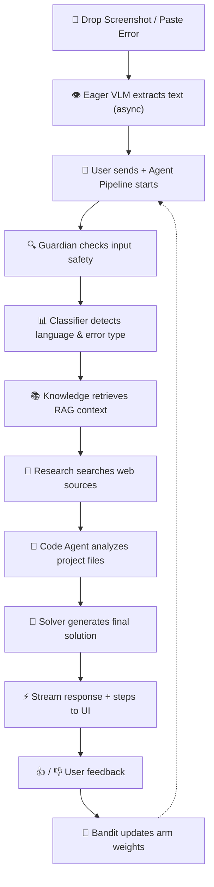

<div align="center">
  
</div>

<h1 align="center">🐞 Debugly</h1>
<h3 align="center">Multi-Agent AI Debugger with Self-Learning Orchestration</h3>

<p align="center">
  Drop a screenshot or paste an error → 10 specialized AI agents collaborate → Get the best solution → System gets smarter over time.
  <br/>
  <strong>100% offline · Privacy-first · Self-improving · Multi-Agent Architecture</strong>
</p>

<p align="center">
  <a href="#"></a>
  <a href="#"></a>
  <a href="#"></a>
  <a href="#"></a>
  <a href="#"></a>
  <a href="#"></a>
</p>

---

## ✨ Key Features

<table>
  <tr>
    <td width="50" align="center">🧠</td>
    <td width="200"><strong>10 Specialized Agents</strong></td>
    <td>Orchestrator, Vision, Classifier, Knowledge, Research, Code, Solver, Guardian, Validator, Learner — each with its own LLM config, tools, and RAG source.</td>
  </tr>
  <tr>
    <td align="center">📸</td>
    <td><strong>Smart OCR Pipeline</strong></td>
    <td>Drop any error screenshot — VLM extracts text automatically on drop (eager processing), results cached for the agent pipeline.</td>
  </tr>
  <tr>
    <td align="center">🎯</td>
    <td><strong>Session Config</strong></td>
    <td>Each session configurable with skills (Debugging, Code Review, Security, etc.), role (Developer, Architect, Reviewer...), and response style (Concise, Detailed, Educational, Creative).</td>
  </tr>
  <tr>
    <td align="center">⚡</td>
    <td><strong>Streaming + Async</strong></td>
    <td>Real-time streaming responses with animated step indicators. Non-blocking async pipeline keeps UI responsive.</td>
  </tr>
  <tr>
    <td align="center">🔄</td>
    <td><strong>Self-Learning RL</strong></td>
    <td>Multi-Armed Bandit algorithm (ε-greedy with decay) learns which debug strategies work best from your feedback.</td>
  </tr>
  <tr>
    <td align="center">🔒</td>
    <td><strong>Fully Offline</strong></td>
    <td>Everything runs locally. Zero data leaves your machine. No API keys, no cloud, no tracking.</td>
  </tr>
  <tr>
    <td align="center">🎨</td>
    <td><strong>Modern UI</strong></td>
    <td>Three-panel layout (Steps · Chat · Changes/Sources), animated step cards with active/completed states, editable session names, dark/light theme, Ctrl+Enter to send.</td>
  </tr>
  <tr>
    <td align="center">📦</td>
    <td><strong>Extensible KB</strong></td>
    <td>ChromaDB vector store with preloaded error-solution pairs. Add your own knowledge base anytime.</td>
  </tr>
</table>

---

## 🛠️ Tech Stack

<div align="center">

| Layer | Technology | Purpose |
|-------|-----------|---------|
| 🖥️ **Desktop UI** |  | Python Flutter UI framework |
| 🔌 **Provider System** | Ollama / OpenAI | Hot-swappable AI providers per agent role |
| ⚙️ **Agent Framework** | Python (custom) | 10-agent orchestrator with MessageBus & ToolRegistry |
| 👁️ **Vision** |  | Screenshot → text extraction |
| 🧠 **LLM (default)** |  | Solution generation & reasoning |
| 🧩 **Embedding** |  | Semantic embedding for RAG |
| 📊 **Vector DB** |  | Persistent semantic search |
| 🎯 **RL Engine** | ε-Greedy Bandit | Epsilon-Greedy Multi-Armed Bandit with decay |
| 🚀 **Packaging** | PyInstaller | Standalone executable builds |

</div>

---

## 🚀 Quick Start

### Prerequisites

- **Python** 3.10 or higher
- **Ollama** — [Download & install](https://ollama.com) (macOS, Linux, Windows)
- **Git**

### Installation

```bash
# 1. Clone the repository
git clone https://github.com/mahdi-ajami/debugly.git
cd debugly

# 2. Create a virtual environment
python -m venv .venv
source .venv/bin/activate       # Linux / macOS
# .venv\Scripts\activate        # Windows

# 3. Install dependencies
pip install -r requirements.txt

# 4. Pull the required AI models
ollama pull gpt-oss:latest
ollama pull glm-ocr:latest
ollama pull mxbai-embed-large:latest

# 5. Seed the knowledge base
python scripts/seed_kb.py

# 6. Launch Debugly
python main.py
```

---

## 🎮 Usage

### New Session Flow
1. Click **New Chat** → **Session Config** form opens
2. Configure:
   - **Session Name** — e.g. "Fix login bug"
   - **Skills** — toggle capabilities: Debugging, Code Review, Architecture, Security, Performance, Testing
   - **Role** — Developer, Architect, Code Reviewer, DevOps, Full Stack
   - **Response Style** — Concise, Detailed, Educational, Creative
3. Click **Start Session**

### Sending Messages
- **Ctrl+Enter** to send, **Enter** for newline
- Type a question or error description
- Drop/attach images (auto-VLM extracted) or code files (auto-read)
- Use **/help** for MCP commands: `/write`, `/edit`, `/search`, `/kb`, etc.

### Session Name
- Click the edit icon next to the session name to rename
- Name is automatically saved and persisted

### Understanding the Interface

```
┌────────────────────────────────────────────────────────────┐
│  Steps Panel  │         Chat Area            │  Changes    │
│  ┌──────────┐  │  ┌──────────────────────┐   │  / Sources  │
│  │ 🔥 Warmup│  │  │ Session Name [edit]  │   │  ┌──────┐  │
│  │   Done ✓ │  │  ├──────────────────────┤   │  │Files │  │
│  │ 👁️ Vision│  │  │ 💬 User message      │   │  │ .py  │  │
│  │   Done ✓ │  │  │ 🤖 Assistant response │   │  │ .ts  │  │
│  │ 💭 Think │  │  │   ┌────────────────┐ │   │  └──────┘  │
│  │   In pr. │  │  │   │ ▼ Thinking...  │ │   │           │  │
│  │ 🔍 Retrv │  │  │   │ ▼ Retrieve...  │ │   │           │  │
│  │   Wait.  │  │  │   │ Solution text  │ │   │           │  │
│  │ 🛠️ Tool  │  │  │   └────────────────┘ │   │           │  │
│  │   Wait.  │  │  └──────────────────────┘   │           │  │
│  └──────────┘  │  [Input...] [Attach] [Send] │           │  │
└────────────────────────────────────────────────────────────┘
```

---

## 🧠 Multi-Agent Architecture

Debugly uses 10 specialized agents coordinated by an orchestrator:

| Agent | Role | Tools |
|-------|------|-------|
| **Orchestrator** | Routes tasks, aggregates results | Workflow modes (sequential/parallel/dynamic) |
| **Vision** | Extracts error text from images | VLMHandler (Ollama VLM) |
| **Classifier** | Classifies error type, language, severity | HuggingFace models |
| **Knowledge** | Retrieves context from ChromaDB RAG | RAGPipeline |
| **Research** | Searches approved web sources | Web search tools |
| **Code Agent** | Analyzes project code and files | File read, grep, directory listing |
| **Solver** | Generates final solution from all contexts | RAGPipeline, LLM |
| **Guardian** | Input/output safety checks, data redaction | Regex patterns, length checks |
| **Validator** | Validates solution syntax (disabled by default) | — |
| **Learner** | Processes feedback, updates bandit weights | RL Bandit |

### Workflow Modes
- **Sequential** — agents run one after another (default)
- **Parallel** — independent agents run concurrently (ThreadPool)
- **Dynamic** — currently same as sequential

### Agent Communication
- **MessageBus** — pub/sub for agent-to-agent messaging
- **ToolRegistry** — shared tool catalog (register, execute, log)
- **Event System** — StepEvent emission for UI streaming

---

## 🔌 Custom Providers

Debugly supports both **Ollama** and **OpenAI-compatible** API providers for every agent role.

| Role | Default Model | Customizable |
|------|--------------|--------------|
| 🧠 **LLM** | `gpt-oss:latest` | Base URL, model, API key |
| 👁️ **VLM (Vision)** | `glm-ocr:latest` | Base URL, model, API key |
| 💬 **Chat** | `gpt-oss:latest` | Base URL, model, API key |
| 📝 **Code** | `gpt-oss:latest` | Base URL, model, API key |
| 🔤 **Embedding** | `mxbai-embed-large:latest` | Base URL, model, API key |

Configure everything from **Settings → AI Providers** in the app.

---

## 📁 Project Structure

```
debugly/
├── main.py                         # Application entry point
├── core/                           # Core AI & agent logic
│   ├── agent.py                    # DebugAgent (backward-compatible wrapper)
│   ├── agent_base.py               # BaseAgent, AgentConfig, AgentInput, AgentOutput
│   ├── agent_orchestrator.py       # AgentOrchestrator (sequential/parallel/dynamic)
│   ├── tool_registry.py            # ToolSpec, ToolRegistry
│   ├── message_bus.py              # AgentMessage, MessageBus
│   ├── agents/                     # 10 agent implementations
│   │   ├── __init__.py             # Agent factory (create_agent)
│   │   ├── orchestrator_agent.py
│   │   ├── vision.py
│   │   ├── classifier.py
│   │   ├── knowledge.py
│   │   ├── researcher.py
│   │   ├── code_agent.py
│   │   ├── solver.py
│   │   ├── guardian.py
│   │   ├── validator.py
│   │   └── learner.py
│   ├── rag_pipeline.py             # RAG pipeline
│   ├── vlm_handler.py              # VLM/OCR handler
│   ├── reward_system.py            # Multi-Armed Bandit RL
│   ├── config.py                   # Central configuration
│   ├── providers.py                # Provider management (Ollama/OpenAI)
│   ├── session.py                  # Session, Message, StepEvent dataclasses
│   ├── database.py                 # SQLite database layer
│   └── project_manager.py          # Project management
├── app/                            # Desktop UI
│   ├── main_view.py                # Main app layout + navigation
│   ├── theme.py                    # Theme system (dark/light)
│   ├── views/
│   │   ├── home_view.py            # Dashboard
│   │   ├── debug_view.py           # Debug interface (redesigned 3-panel)
│   │   ├── history_view.py         # Session history
│   │   ├── settings_view.py        # App settings + providers
│   │   └── kb_view.py              # Knowledge base management
│   └── components/
│       ├── chat_bubble.py          # Redesigned chat bubbles with avatars
│       ├── step_view.py            # Animated step indicators (active/completed/error)
│       ├── session_form.py         # Session config dialog (skills, roles, style)
│       ├── drag_drop_zone.py       # Drag-and-drop file zone
│       ├── diff_view.py            # Side-by-side diff cards
│       ├── detailed_footer.py      # Status bar footer
│       ├── toolbar.py              # Top toolbar
│       ├── session_list.py         # Session list sidebar
│       ├── file_tree.py            # File tree sidebar
│       ├── feedback_bar.py         # Feedback controls
│       └── status_bar.py           # Bottom status indicator
├── models/
│   └── schemas.py                  # Pydantic schemas (AgentState, etc.)
├── db/                             # Database files
├── knowledge_base/                 # Seed data
├── scripts/                        # Maintenance scripts
├── assets/                         # Icons, images
├── requirements.txt
├── .gitignore
└── README.md
```

---

## 🧠 How It Works



### Agent Pipeline Steps
| Step | Agent | Duration |
|------|-------|----------|
| 🔥 **Warmup** | Orchestrator | ~100ms |
| 👁️ **Vision** | Vision Agent (VLM) | ~1-5s (if image attached) |
| 🛡️ **Guardian** | Guardian Agent | ~50ms |
| 📊 **Classifier** | Classifier Agent | ~200ms |
| 📚 **Knowledge** | Knowledge Agent | ~500ms |
| 🔬 **Research** | Research Agent | ~1-3s |
| 📝 **Code** | Code Agent | ~500ms-2s |
| 🧩 **Solver** | Solver Agent | ~5-30s |
| ✅ **Done** | — | — |

---

## 📌 Roadmap

| Status | Feature |
|--------|---------|
| ✅ | Multi-agent architecture (10 agents) |
| ✅ | Orchestrator with sequential/parallel/dynamic modes |
| ✅ | Eager VLM processing on image drop |
| ✅ | Eager file reading on code file drop |
| ✅ | Session config form (skills, roles, prompt style) |
| ✅ | Animated step indicators (active/completed/error) |
| ✅ | Editable session name with persistence |
| ✅ | VLM switching mid-conversation |
| ✅ | Ctrl+Enter to send, Enter for newline |
| ✅ | Non-blocking async UI pipeline |
| ✅ | Three-panel layout (Steps · Chat · Changes) |
| ✅ | Dark / Light theme |
| ✅ | Custom AI providers (Ollama / OpenAI) |
| ✅ | Multi-Armed Bandit RL |
| ✅ | Streaming responses with step-by-step display |
| 🔄 | Multi-image / multi-error support |
| 🔄 | Advanced session search & filtering |
| 🔄 | Plugin system for custom agents |
| 🔄 | One-click installer (Windows / macOS / Linux) |

---

## 🤝 Contributing

Contributions welcome — whether it's a typo fix, a new agent, or a major feature.

1. **Fork** the project
2. **Create** your feature branch (`git checkout -b feat/awesome-idea`)
3. **Commit** your changes (`git commit -m 'feat: add awesome idea'`)
4. **Push** to the branch (`git push origin feat/awesome-idea`)
5. **Open** a Pull Request

---

<p align="center">
  Made with ❤️ for developers<br/>
  <sub>Built with Python · Flet · Ollama · ChromaDB · Multi-Agent RL</sub>
  <br/><br/>
  <a href="#">⭐ Star this project</a> · 
  <a href="https://github.com/mahdi-ajami/debugly/issues">🐛 Report a bug</a>
</p>
