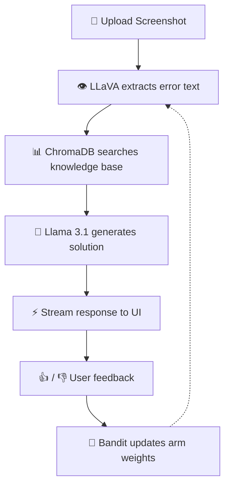

<div align="center">
  
</div>

<h1 align="center">🐞 Debugly</h1>
<h3 align="center">Intelligent Screenshot-powered Error Debugger with Self-Learning AI</h3>

<p align="center">
  Take a screenshot of any error → AI understands it → Finds the best solution → Gets smarter over time.
  <br/>
  <strong>100% offline · Privacy-first · Self-improving · Flat UI</strong>
</p>

<p align="center">
  <a href="#"></a>
  <a href="#"></a>
  <a href="#"></a>
  <a href="#"></a>
  <a href="#"></a>
  <a href="#"></a>
  <a href="#"></a>
  <a href="#"></a>
</p>

<br/>

---

## ✨ Key Features

<table>
  <tr>
    <td width="50" align="center">📸</td>
    <td width="200"><strong>Screenshot OCR</strong></td>
    <td>Upload any error screenshot — LLaVA extracts the error message automatically, whether from terminal, IDE, browser, or log file.</td>
  </tr>
  <tr>
    <td align="center">🧠</td>
    <td><strong>RAG-Powered Answers</strong></td>
    <td>Retrieves the most relevant solutions from your local knowledge base using ChromaDB + LangChain for accurate, contextual answers.</td>
  </tr>
  <tr>
    <td align="center">⚡</td>
    <td><strong>Streaming Responses</strong></td>
    <td>Watch answers appear word-by-word in real time — no waiting for the full response.</td>
  </tr>
  <tr>
    <td align="center">🔄</td>
    <td><strong>Self-Learning RL</strong></td>
    <td>Every 👍 / 👎 trains a Multi-Armed Bandit algorithm to favor strategies that historically deliver better solutions.</td>
  </tr>
  <tr>
    <td align="center">🔒</td>
    <td><strong>Fully Offline</strong></td>
    <td>Everything runs locally on your machine. Zero data leaves your computer. No API keys, no cloud, no tracking.</td>
  </tr>
  <tr>
    <td align="center">🪟</td>
    <td><strong>Flat UI</strong></td>
    <td>Clean slate-based design with frosted panels, smooth animations, drag-and-drop zone, and dark/light theme support.</td>
  </tr>
  <tr>
    <td align="center">📦</td>
    <td><strong>Extensible KB</strong></td>
    <td>Preloaded with solutions for Python, Docker, FastAPI, JavaScript, and more. Add your own knowledge base anytime.</td>
  </tr>
</table>

---

## 🛠️ Tech Stack

<div align="center">

| Layer | Technology | Purpose |
|-------|-----------|---------|
| 🖥️ **Desktop UI** |  | Python-based Flutter UI framework with flat design |
| 🔌 **Provider System** | Ollama / OpenAI | Hot-swappable AI providers per role |
| ⚙️ **Backend** |  | Core engine (LLM orchestration) |
| 👁️ **Vision** |  | Screenshot → error text extraction |
| 🧠 **LLM** |  | Solution generation & reasoning |
| 🧩 **Embedding** |  | Semantic embedding for RAG |
| 📊 **Vector DB** |  | Persistent semantic search |
| 🔗 **Orchestration** |  | RAG pipeline & chain management |
| 🎯 **RL Engine** | ε-Greedy Bandit | Epsilon-Greedy Multi-Armed Bandit |
| 🚀 **Packaging** | PyInstaller | Standalone executable builds |

</div>

---

## 🚀 Quick Start

### Prerequisites

- **Python** 3.10 or higher
- **Ollama** — [Download & install](https://ollama.com) (available for macOS, Linux, Windows)
- **Git**

### Installation

```bash
# 1. Clone the repository
git clone https://github.com/yourusername/debugly.git
cd debugly

# 2. Create a virtual environment (recommended)
python -m venv .venv
source .venv/bin/activate       # Linux / macOS
# .venv\Scripts\activate        # Windows

# 3. Install dependencies
pip install -r requirements.txt

# 4. Pull the required AI models
ollama pull qwen3-coder:30b
ollama pull llava:7b
ollama pull mxbai-embed-large:latest

# 5. Seed the knowledge base
python scripts/seed_kb.py

# 6. Launch Debugly
python main.py
```

> 🎉 The app will initialize ChromaDB and open the Debugly desktop window. You're ready to debug!

---

## 🔌 Custom Providers

Debugly supports both **Ollama** and **OpenAI-compatible** API providers for every model role.

| Role | Default Model | Customizable |
|------|--------------|--------------|
| 🧠 **LLM** | `qwen3-coder:30b` | Base URL, model, API key |
| 👁️ **VLM (Vision)** | `llava:7b` | Base URL, model, API key |
| 💬 **Chat** | `qwen3-coder:30b` | Base URL, model, API key |
| 📝 **Code** | `qwen3-coder:30b` | Base URL, model, API key |
| 🔤 **Embedding** | `mxbai-embed-large:latest` | Base URL, model, API key |

Configure everything from **Settings → AI Providers** in the app — no need to edit config files. Supports OpenAI-compatible APIs (e.g., LiteLLM, LocalAI, vLLM) with custom `base_url` and `api_key`.

---

## 🖥️ Interface

```
┌────────────────────────────────────────────────────────┐
│  ┌────────┐  ┌──────────────────────────────────────┐  │
│  │  Home   │  │                                      │  │
│  │  Debug  │  │    Frosted glass content area        │  │
│  │ History │  │    with animated transitions         │  │
│  │Settings │  │                                      │  │
│  │   KB    │  │    ┌── Drag & Drop ──────────────┐   │  │
│  │         │  │    │  Drop screenshot here        │   │  │
│  │         │  │    │  or click to browse           │   │  │
│  └────────┘  │    └──────────────────────────────┘   │  │
│              │    ┌── Chat ───────┐ ┌── Sources ──┐  │  │
│              │    │  💬 ...       │ │  doc 1      │  │  │
│              │    │  🤖 ...       │ │  doc 2      │  │  │
│              │    └───────────────┘ └─────────────┘  │  │
│              │    [Type error message...] [Send]      │  │
│              │    [👍 Was this helpful? 👎]           │  │
│  ┌──────────┴──────────────────────────────────────┐  │  │
│  │  Status Bar: ● Ollama  │  KB: 12 docs            │  │  │
│  └─────────────────────────────────────────────────┘  │  │
└────────────────────────────────────────────────────────┘
```

---

## 📁 Project Structure

```
debugly/
├── main.py                      # Application entry point
│
├── core/                        # Core AI & ML logic
│   ├── agent.py                 # LangChain orchestrator agent
│   ├── rag_pipeline.py          # RAG pipeline
│   ├── vlm_handler.py           # LLaVA integration for screenshot OCR
│   ├── reward_system.py         # Multi-Armed Bandit RL engine
│   └── config.py                # Central configuration
│
├── app/                         # Desktop UI (Glass Design)
│   ├── main_view.py             # Navigation rail + view routing
│   ├── theme.py                 # Glass/Minimal theme system
│   ├── views/
│   │   ├── home_view.py         # Dashboard with stats
│   │   ├── debug_view.py        # Debug interface (chat + sources)
│   │   ├── history_view.py      # Search history
│   │   ├── settings_view.py     # App settings
│   │   └── kb_view.py           # Knowledge base management
│   └── components/
│       ├── chat_bubble.py       # Markdown-rendered chat bubbles
│       ├── code_block.py        # Syntax-highlighted code with copy
│       ├── drag_drop_zone.py    # Drag-and-drop upload zone
│       ├── feedback_bar.py      # 👍 / 👎 feedback controls
│       ├── skeleton.py          # Shimmer loading states
│       └── status_bar.py        # Bottom status indicator
│
├── db/                          # Vector database
│   └── chroma.py                # ChromaDB client
│
├── models/                      # Data models
│   └── schemas.py               # Pydantic schemas
│
├── utils/                       # Utility functions
│   └── helpers.py               # ID generation, text helpers
│
├── knowledge_base/              # Seed data
│   └── seed.py                  # 12 error-solution pairs
│
├── scripts/                     # Maintenance scripts
│   └── seed_kb.py               # CLI to populate ChromaDB
│
├── assets/                      # Icons, images
│   └── icon.png                 # Application icon
│
├── requirements.txt
├── .gitignore
└── README.md
```

---

## 🧠 How It Works



### The 4-Step Debug Loop

| Step | What Happens |
|------|-------------|
| **1. Capture** | Drop a screenshot of any error — terminal, VS Code, browser console, or log viewer |
| **2. Extract** | LLaVA (Vision-Language Model) reads the image and extracts the exact error text |
| **3. Retrieve** | ChromaDB finds the most semantically similar solutions from the knowledge base |
| **4. Learn** | Your 👍 / 👎 feedback trains the Multi-Armed Bandit to prioritize what works best |

---

## 📌 Roadmap

| Status | Feature |
|--------|---------|
| ✅ | Screenshot → text extraction with LLaVA |
| ✅ | Local RAG pipeline with ChromaDB |
| ✅ | Streaming response UI |
| ✅ | Multi-Armed Bandit reinforcement learning |
| ✅ | Glass UI with NavigationRail + drag-and-drop |
| ✅ | Dark / Light theme toggle |
| ✅ | Markdown rendering with syntax highlighting |
| ✅ | Custom AI providers (Ollama / OpenAI compatible) |
| ✅ | Provider config UI (LLM, VLM, Chat, Code, Embedding) |
| 🔄 | Multi-image / multi-error support |
| 🔄 | Side-by-side diff view (before / after fix) |
| 🔄 | Plugin system for custom knowledge sources |
| 🔄 | History persistence with search |
| 🔄 | One-click installer (Windows / macOS / Linux) |

---

## 🤝 Contributing

Contributions of all sizes are welcome — whether it's a typo fix, a new knowledge base entry, or a major feature.

1. **Fork** the project
2. **Create** your feature branch (`git checkout -b feat/awesome-idea`)
3. **Commit** your changes (`git commit -m 'feat: add awesome idea'`)
4. **Push** to the branch (`git push origin feat/awesome-idea`)
5. **Open** a Pull Request

> Please ensure your code is clean, well-documented, and passes existing checks before submitting.

---

<p align="center">
  Made with ❤️ for developers<br/>
  <sub>Built with Python · Flet · Ollama · ChromaDB · LangChain</sub>
  <br/><br/>
  <a href="#">⭐ Star this project</a> · 
  <a href="https://github.com/yourusername/debugly/issues">🐛 Report a bug</a> · 
  <a href="https://github.com/yourusername/debugly/discussions">💬 Join discussion</a>
</p>
